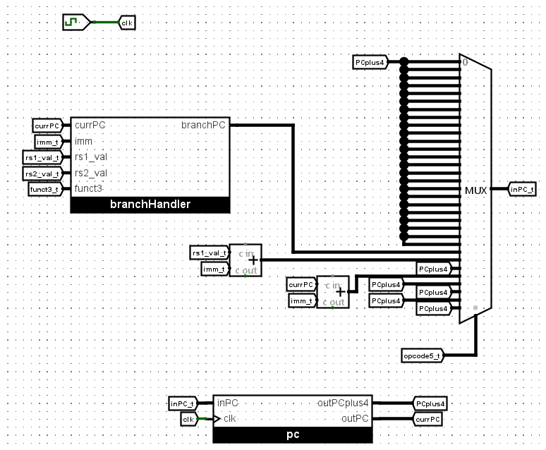
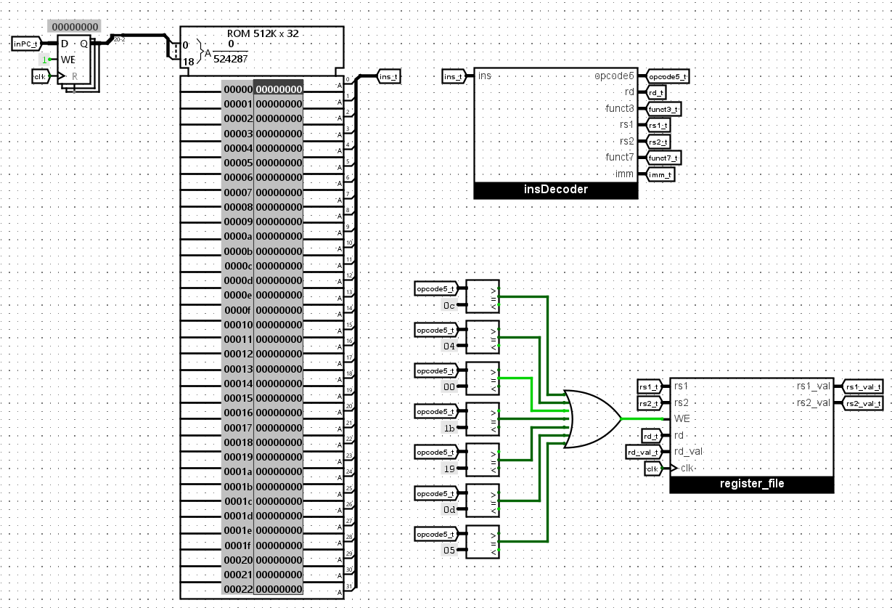
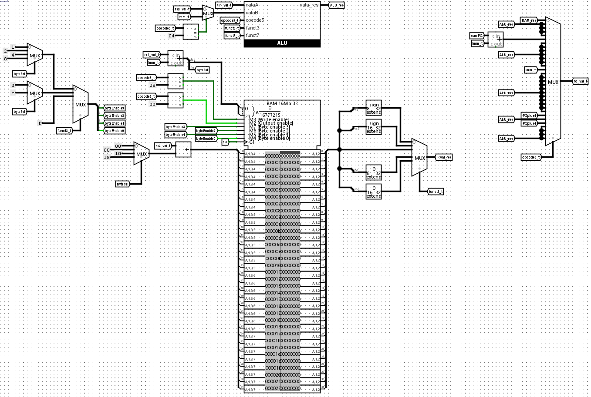
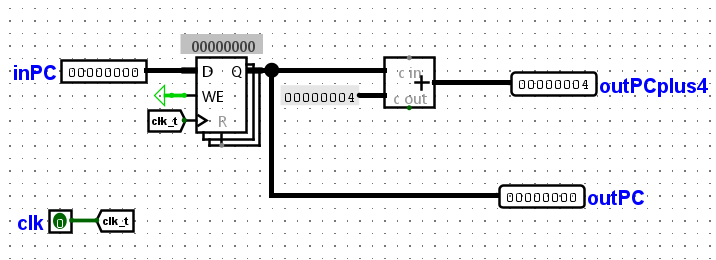
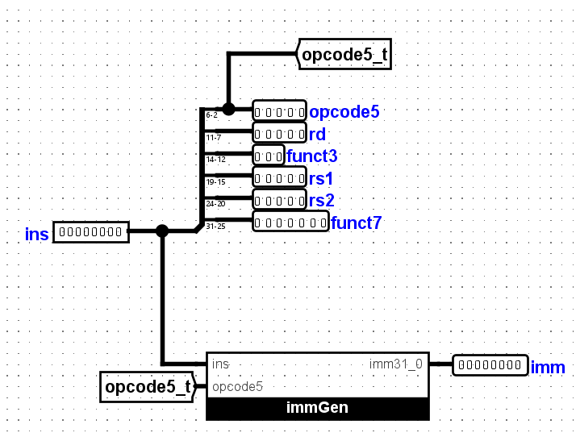
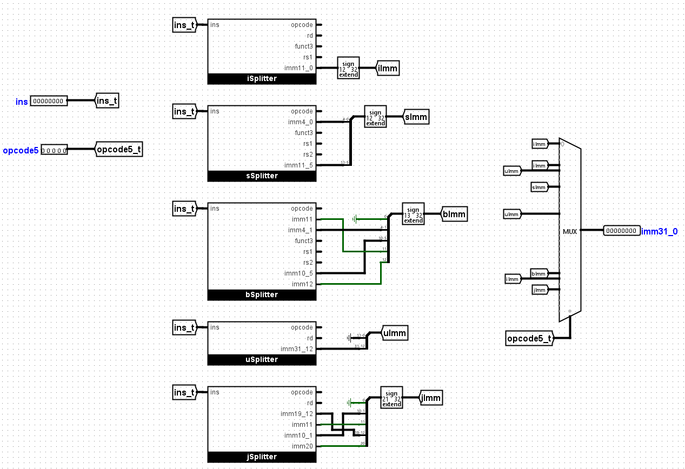
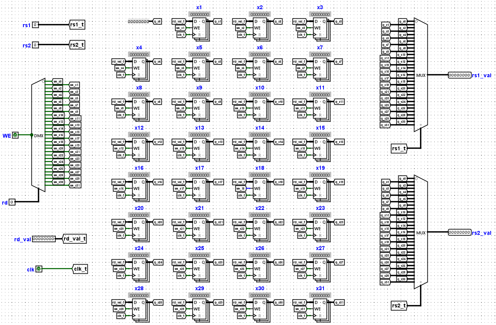
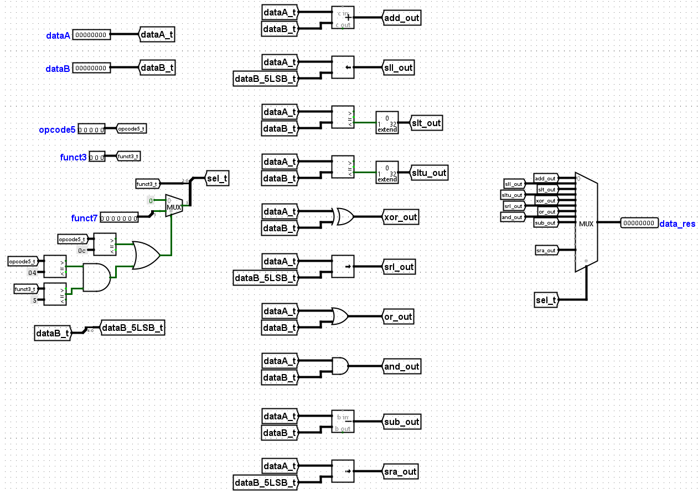
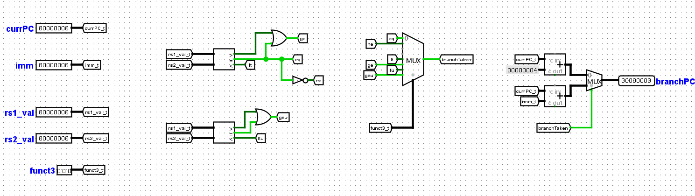

# Single-Cycle RV32I Microprocessor implementation in Logisim Evolution

  
  
  

A complete, fully functional 32-bit single-cycle microprocessor implementing the standard **RISC-V RV32I Base Integer Instruction Set** (excluding environment calls `ecall` and `ebreak`). This processor was designed entirely from scratch using [Logisim Evolution](https://github.com/logisim-evolution/logisim-evolution).

---

## 🚀 Features & Supported Instructions

This processor successfully decodes and executes the RV32I instruction set, supporting comprehensive data manipulation, control flow, and byte-addressable memory operations.

* **R-Type (Register-Register):** `add`, `sub`, `sll`, `slt`, `sltu`, `xor`, `srl`, `sra`, `or`, `and`
* **I-Type (Register-Immediate):** `addi`, `slti`, `sltiu`, `xori`, `ori`, `andi`, `slli`, `srli`, `srai`
* **Memory Access (Load/Store):** `lw`, `sw`, `lb`, `lh`, `sb`, `sh`, `lbu`, `lhu` *(Fully supports sub-word memory operations using RAM byte-enables)*
* **Control Flow (Branch/Jump):** `beq`, `bne`, `blt`, `bge`, `bltu`, `bgeu`, `jal`, `jalr`
* **Upper Immediate:** `lui`, `auipc`

---

## 🧩 Hardware Architecture & Datapath

The processor follows a strict single-cycle data path. Below is a complete breakdown of the top-level circuitry and its underlying submodules.

### Top-Level Datapath

The main circuit wires together all components. It is divided into three primary visual stages:

**1. PC Logic & Next Address Selection:** Handles the logic for determining the next instruction address (PC + 4, Branch Target, or Jump Target).

  

**2. Instruction Fetch & Decode Stage:**
Fetches the instruction from the 512K x 32 ROM, decodes the opcode, and reads the necessary values from the Register File.

  

**3. Execution, Memory & Write-Back Stage:**
Executes operations in the ALU, interfaces with the 16M x 32 RAM (including byte-enable logic for sub-word memory access), and routes the final data back to the destination register.

  

---

### Core Submodules

**Program Counter (PC)**
Maintains the current address of the instruction being executed and continuously computes `PC + 4`.

  

**Instruction Decoder**
Splits the raw 32-bit instruction into its specific RV32I fields: `opcode`, `rd`, `funct3`, `rs1`, `rs2`, and `funct7`.

  

**Immediate Generator (`immGen`)**
Parses the instruction and handles the sign-extension and formatting for I, S, B, U, and J-type immediates based on the decoded opcode.

  

**Register File**
Contains 32 general-purpose 32-bit registers (`x0` through `x31`), where `x0` is hardwired to zero. It supports two simultaneous asynchronous reads (`rs1`, `rs2`) and one synchronous write (`rd`).

  

**Arithmetic Logic Unit (ALU)**
A custom 32-bit ALU responsible for all arithmetic, logical, and shift operations. It selects the correct resulting output based on derived control signals.

  

**Branch Handler**
Computes branch outcomes by comparing register values and verifying condition codes (`funct3`). It simultaneously calculates the target PC address if the branch condition is met.

  

---

## 🛠️ How to Run & Simulate

To simulate the processor locally, you will need **Logisim Evolution**. Standard Logisim will **not** work due to missing components and different file formatting.

1. **Install Logisim Evolution:** Download it from the [official GitHub repository](https://github.com/logisim-evolution/logisim-evolution).
2. **Open the Project:** Clone this repository and open the `.circ` file in Logisim Evolution.
3. **Load a Program:**
    * Write your RISC-V assembly and compile it to a raw hex format.
    * Right-click the **ROM** component in the top-level main circuit.
    * Select `Load Image...` and choose your hex file.
4. **Run the Simulation:**
    * Enable the clock tick (`Ctrl + T` or `Cmd + T`).
    * To view memory writes, inspect the **RAM** component in the main circuit.
